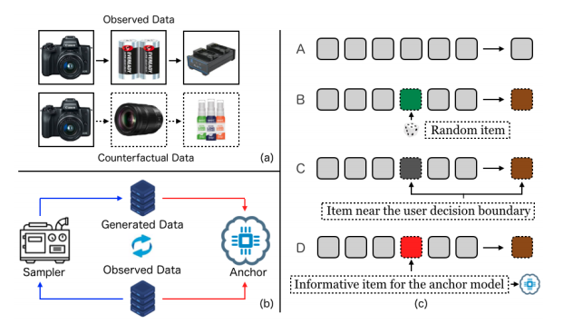
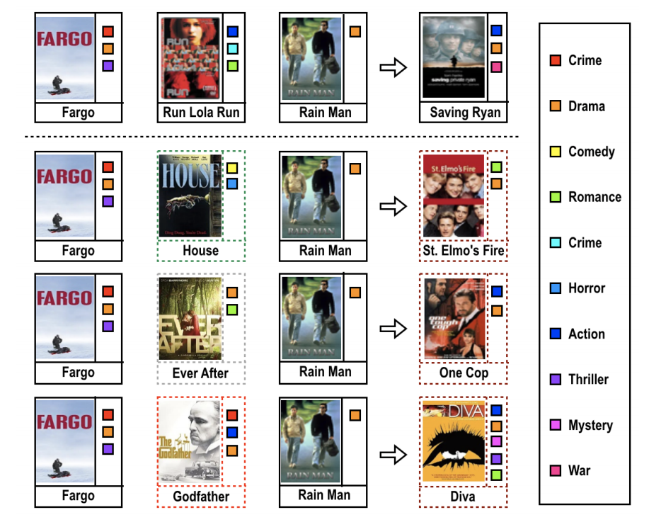
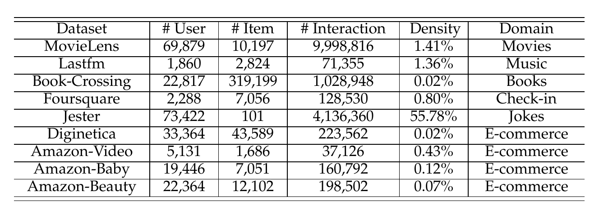

#Sequential Recommendation with Counterfactual Data Augmentation
A PyTorch implementation of Sequential Recommendation with Counterfactual Data Augmentation
# Architecture
(a) A toy example of the potential user behavior
sequence. (b) Our general framework, which is composed of
a sampler model and an anchor model. The sampler model
aims to generate new user behavior sequences, and the anchor model is used to provide recommendations, which is
trained based on the observed and generated data. (c) Three
methods for generating user behavior sequences. A is the
original data. B is the heuristic method where the historical
item is changed in a random manner. C and D are learning
based methods,


# case

Case study. In the first line, we present the original user behavior sequence. The second line is the sequence
generated from the heuristic method. The samples produced
from the learning-based methods are shown in the third (dataoriented method) and forth (model-oriented method) lines. For
clear presentation, we download the picture of each movie from
[Amzon](https://www.amazon.com/), and the categories of the movies are also
presented for reference.


# Usage
1.Install required package from requirements.txt file.
```bash
pip install -r requirements.txt
```
2.Download datasets used in the paper:[MovieLens](https://grouplens.org/datasets/movielens/),
[LastFm](http://millionsongdataset.com/lastfm/),[Book-crossing](http://www2.informatik.uni-freiburg.de/cziegler/BX/),
[Foursquare](https://sites.google.com/site/yangdingqi/home/foursquare-dataset),[Jester](http://eigentaste.berkeley.edu/dataset/),
[Diginetica](https://competitions.codalab.org/competitions/11161) and [Amzon](http://jmcauley.ucsd.edu/data/amazon/).
Put the  specific files which needed to contain `user_id:token,item_id:token,timestamp:float` named `dataset name.inter` into the folder `datasets/dataset name/`.
we have listed some example datasets that one could follow it.



3.Before you can run our program,you should run run_test_example.py or run_hyper.py to train Sampler model and Anchor model firstly.
we  provided source code for three models NARM,STAMP and SASRec.
```bash
python run_test_example.py  -d diginetica -m NARM -r 0.01
python run_test_example.py  -d amazon_instant_vide -m STATMP -r 0.01
python run_test_example.py  -d lastfm -m SASRec -r 0.001
```
We also provide automatic parameter tuning tools.
In hyper.test file,setting up the range of tuning parameter such as:
```bash
learning_rate loguniform -8,0
embedding_size choice [64,96,128]
train_batch_size choice [512,1024,2048]
mlp_hidden_size choice ['[64,64,64]','[128,128]']
```
then run run_pyper.py
```bash
python run_hyper.py --model=NARM --dataset=ml-1m \
--config_files=dataset name.yaml --params_file=hyper.test
```
you should also save the trained model named `Model name-dataset name.pth`,in which the model name is one of the three model NARM,
STAMP and SASRec,and put it in the folder `savedTrainer/`.we have trained some model as examples which could be used to train our method directly.

4.Run main.py file to train our model.You can configure some training parameters through the command line
```bash
python main.py --sampler_model NARM --anchor_model STAMP --dataset lastfm 
--epochs 30 --batch_size 512 --learning Learning --index 2 --learning_rate 0.01 --kappa 0 
-- tao 1 --sample 1 --iter 1 --beta 1

```
where --learning denotes one of our methods 'Heuristic','Learning' and 'AD' representing heuristic
,data-and model-oriented methods respectively. --sample denotes the number of sample,--kappa denotes
the confidence parameter,--iter denotes the iteration number,--tao denotes the temperature parameter.
The range of parameter is as follows:
```bash
learning rate:[0.1,0.01,0.001,0.0001]
batch size:[64,128,256,512,1024]
beta:[10^-5,10^-4,...,10^4,10^5]
the sample number:[0,0.1,0.2,0.3,0.4,0.5,0.6,0.7,0.8,0.9,1]
the iteration number:[1,2,3,4,5,6,7,8,9,10]
the confidence parameter:[0.0,10^8,10^6,10^4,10^2,,0.1,0.2,0.3,0.4,0.5,0.6,0.7,0.8,0.9,1.0].
the intervention index:[1,2,3,4,5,6]
the temperature parameter:[0.1,0.3,0.5,0.7,0.9,1.1,1.2,1.5,1.7,1.9,2.1,2.3,2.5,2.7,2.9]
```


